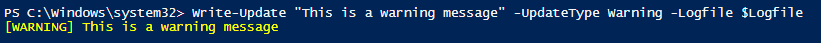
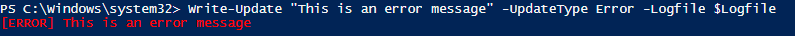
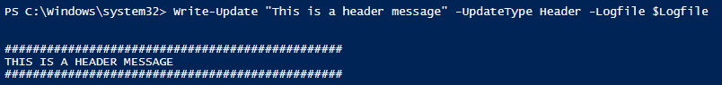
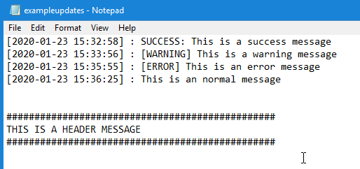

# Write-Update
Powershell function that displays user friendly messages as well as optionally logging it to a file. When logging to a file, it timestamps the message as well. See the examples below for more info.

### Basic Usage
```powershell 
Write-Update "This is a sample message" -UpdateType Normal -Logfile $Logfile
```
### Getting the message from the pipeline
```powershell 
"This is a success message" | Write-Update -UpdateType Normal -Logfile $Logfile
```

# Output Examples

### Success message
```powershell 
Write-Update "This is a success message" -UpdateType Success -Logfile $Logfile
```
##### Output


### Warning message
```powershell 
Write-Update "This is a warning message" -UpdateType Warning -Logfile $Logfile
```
##### Output



### Error message
```powershell 
Write-Update "This is an error message" -UpdateType Error -Logfile $Logfile
```
##### Output



### Header message
```powershell 
Write-Update "This is a header message" -UpdateType Header -Logfile $Logfile
```
##### Output




## Example log
Finally, here is what the log looks like. Note the timestamps on each non-header message.


