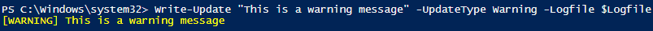

# Write-Update
Powershell function that displays user friendly messages as well as optionally logging it to a file. When logging to a file, it timestamps the message as well. See the examples below for more info.

## Success message
```powershell 
Write-Update "This is a success message" -UpdateType Success -Logfile $Logfile
```
#### Screenshot


## Warning message
```powershell 
Write-Update "This is a warning message" -UpdateType Warning -Logfile $Logfile
```
#### Screenshot



## Error message
```powershell 
Write-Update "This is an error message" -UpdateType Error -Logfile $Logfile
```
#### Screenshot


## Header message
```powershell 
Write-Update "This is a header message" -UpdateType Header -Logfile $Logfile
```
#### Screenshot


## Example log
Finally, here is what the log looks like. Note the timestamps on each non-header message.
#### Screenshot


